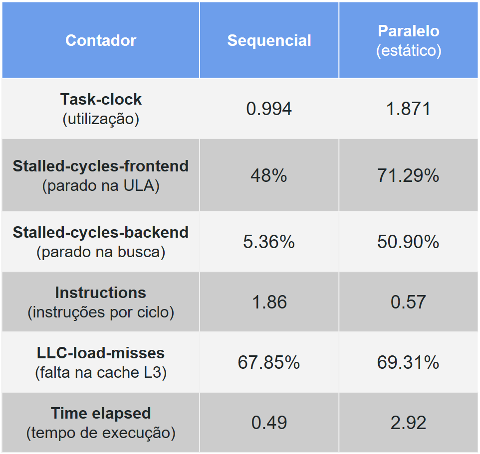
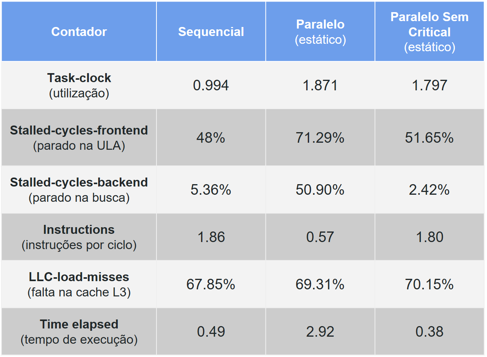
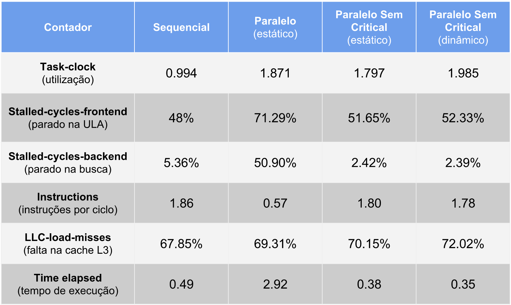

# Tutorial 04: Identificando Gargalos em OpenMP com a Ferramenta Perf

### Você vai aprender
* Como usar a ferramenta Perf para ler contadores de hardware.
* Como identificar gargalos de desempenho em uma aplicação paralela OpenMP.
* Como remover gargalos de desempenho em uma aplicação OpenMP.

### Pré-requisitos
* Tutorial 02: Resolvendo Condições de Disputa em OpenMP
* Tutorial 03: Balanceamento de Carga em OpenMP​​​​​​​
* Ter a ferramenta `perf` instalada no seu computador:

```bash
$ sudo apt-get install linux-tools
```

### Silly sort!?

Dado um vetor de inteiros não repetidos, para cada elemento, o Silly Sort conta quantos inteiros são menores que ele e armazena em um vetor auxiliar. Estes contadores indicam qual a posição em que cada elemento deveria estar no vetor ordenado. Então ele cria um vetor ordenado de saída, copiando cada elemento do vetor de entrada para a posição determinada pelo vetor auxiliar.

No código abaixo, o Silly Sort ordena um vetor de entrada de n inteiros inicialmente em ordem decrescente.

Ao final, ele checa se o vetor foi ordenado corretamente.

```c
#include <stdio.h>
#include <stdlib.h>

int main() 
{
   int i, j, n = 10000; 

   // Allocate input, output and position arrays
   int *in = (int*) calloc(n, sizeof(int));
   int *pos = (int*) calloc(n, sizeof(int));   
   int *out = (int*) calloc(n, sizeof(int));   

   // Initialize input array in the reverse order
   for(i=0; i < n; i++)
      in[i] = n-i;  

   // Silly sort
   for(i=0; i < n; i++) 
      for(j=0; j < n; j++)
	if(in[i] >= in[j]) 
           pos[j]++;	

   // Move elements to final position
   for(i=0; i < n; i++) 
      out[n-pos[i]] = in[i];
   
   // Check if answer is correct
   for(i=0; i < n; i++)
      if(i+1 != out[i]) 
      {
         printf("test failed\n");
         exit(0);
      }

   printf("test passed\n"); 
}  
```

Primeiro copie o código acima para um arquivo chamado silly_sort.c. 

Vamos então compilar o programa com o seguinte comando:

```bash
$ gcc silly_sort.c -o silly_sort
```

Para medir o tempo de execução da aplicação, utilize o seguinte comando:

```bash
$ time ./silly_sort
```

Uma saída esperada para esse programa é a seguinte:

```txt
test passed

real  0m0.501s
user  0m0.496s
sys   0m0.000s
```   

### Paralelizando a ordenação

No Silly Sort existem duas condições de disputa que devem ser tratadas. Quais são elas?

<details>
<summary>Resposta</summary>

O contador "j" do laço interno deve ser privado para cada thread. O vetor pos[j] é compartilhado e pode ser atualizado por mais de uma thread simultaneamente. Portanto, o acesso ao vetor pos[j] deve ser protegido por um omp critical.
</details>

```c
// Silly sort
#pragma omp parallel for private(j) num_threads(2)
for(i=0; i < n; i++)
  for(j=0; j < n; j++)
    if(in[i] >= in[j])
    {
      #pragma omp critical
       pos[j]++;
    }
```

Substitua apenas o trecho de código acima no programa original.

Vamos então compilar o programa com o seguinte comando:

```bash
$ gcc silly_sort.c -o silly_sort -fopenmp
```

Para medir o tempo de execução da aplicação, utilize o seguinte comando:

```bash
$ time ./silly_sort
```

Uma saída esperada para esse programa é a seguinte:   

```txt
test passed

real	0m2.920s
user	0m4.550s
sys	0m1.059s
```   

A versão paralela ficou muito mais lenta que a sequencial. Por que?

<details>
<summary>Resposta</summary>
Não sabemos exatamente, pois medimos apenas o tempo de execução da aplicação. Precisamos investigar melhor ...
</details>

### Usando o perf para identificar gargalos

A ferramenta Perf mede os contadores de hardware durante a execução de uma aplicação (sequencial ou paralela). Ela permite que sejam coletadas informações sobre a utilização do processador, ciclos parados, instruções por ciclo, faltas em cache etc. Com estas informações é possível determinar possíveis gargalos de desempenho em aplicações paralelas.

Vamos executar o Silly sort com o seguinte comando:

```bash
$ perf stat -d ./silly_sort
```

A opção -d faz um profiling detalhado, ou seja, utilizando vários contadores de hardware.
Uma possível saída para a versão paralela seria:

```bash
Performance counter stats for './silly_sort':

5478,363549      task-clock (msec)         #    1,871 CPUs utilized          
   144   context-switches          #    0,026 K/sec                  
   1     cpu-migrations            #    0,000 K/sec                  
   214   page-faults               #    0,039 K/sec                  
12.975.989.653    cycles                    #    2,369 GHz                     [39,94%]
9.250.737.973     stalled-cycles-frontend   #   71,29% frontend cycles idle    [40,01%]
6.604.551.138     stalled-cycles-backend    #   50,90% backend  cycles idle    [40,03%]
7.446.955.272     instructions              #    0,57  insns per cycle        
                                             #    1,24  stalled cycles per insn [50,07%]
1.423.047.462        branches                  #  259,758 M/sec                   [50,18%]
11.950.386           branch-misses             #    0,84% of all branches         [50,12%]
2.699.950.126        L1-dcache-loads           #  492,839 M/sec                   [50,08%]
39.411.491           L1-dcache-load-misses     #    1,46% of all L1-dcache hits   [50,00%]
4.905.688            LLC-loads                 #    0,895 M/sec                   [39,91%]
3.397.226            LLC-load-misses           #   69,25% of all LL-cache hits    [39,92%]

2,927838814 seconds time elapsed
```

Da esquerda para direita, temos: a quantidade, o contador, a métrica e a porcentagem.

Estes contadores são multiplexados, ou seja, não é possível medir todos ao mesmo tempo, pois existe um número pequeno de registradores. Então eles são amostrados durante uma porcentagem [%] do tempo total de execução.

De todas as informações mostradas, vamos nos concentrar nas seguintes métricas: CPUs utilized (utilização), frontend cycles idle (ciclos ociosos na ULA), backend cycles idle (ciclos ociosos na busca de instrução), insns per cycle (IPC ou instruções por ciclo) , LL-cache hits (taxa de falta na cache L3) e time elapsed (tempo total de execução).

Compile e execute o código sequencial com o comando perf e compare estas seis métricas com a versão paralela (a política de escalonamento default é a estática). A tabela abaixo sumariza estes resultados medidos.



Podemos notar quatro pontos importantes. Quais são eles?

<details>
<summary>Resposta</summary>

* A utilização deveria ser mais próxima de 2, pois o programa paralelo utiliza dois núcleos.

* O número de ciclos ociosos ou parados aumentou muito do sequencial para o paralelo, principalmente no backend.

* O IPC também caiu para um terço da versão sequencial.

* Por último, o taxa de falta de cache não sofreu muita variação, apesar de alta nos dois casos.
</details>


## Removendo condições de disputa

O aumento mais significativo entre a versão sequencial e a paralela ocorreu nas métricas de ciclos ociosos. Um pipeline parado significa que o processador está esperando por dados da memória ou threads estão dormindo devido a um número excessivo de sincronizações.

Geralmente quando um #pragma omp critical é chamado com frequência, as threads passam a maioria do tempo dormindo. 
Mas como remover o #pragma omp critical ?

<details>
<summary>Resposta</summary>
Não existe uma maneira simples para isso apenas utilizando as diretivas no OpenMP 3.0, mas o OpenMP 4.5 possui uma diretiva reduction e uma diretiva atomic.

Para esse código funcionar em OpenMP 3.0, é necessário modificar o código.

Duas modificações principais são necessárias:

* i) a criação de um vetor de posições separado (privado) para cada thread, para remover a condição de disputa;

* ii) fazer uma redução manualmente (sem a diretiva reduction) para somar as posições (deslocamentos) para cada elemento.
</details>

```c
#include <stdio.h>
#include <stdlib.h>
#include <omp.h>

int main() 
{
   int i, j, n = 10000;
   int nthreads = 2; 

   // Allocate input, output and position arrays
   int *in = (int*) calloc(n, sizeof(int));
   int *out = (int*) calloc(n, sizeof(int));   
   int **pos = (int**) calloc(nthreads, sizeof(int*));   

   // Initialize input array in the reverse order
   for(i=0; i < n; i++)
      in[i] = n-i;  

   // Silly sort
   #pragma omp parallel num_threads(nthreads) private(i,j)
   {
     int tid = omp_get_thread_num();
     pos[tid] = (int*) calloc(n, sizeof(int));   
     
     #pragma omp for
     for(i=0; i < n; i++) 
       for(j=0; j < n; j++)
	 if(in[i] >= in[j]) 
           pos[tid][j]++;
   }

   // Move elements to final position
   for(i=0; i < n; i++) 
   {
     int pos_final = 0;
     for(j=0; j < nthreads; j++) 
       pos_final+= pos[j][i];
      
     out[n-pos_final] = in[i];
   }

   // Check if answer is correct
   for(i=0; i < n; i++)
      if(i+1 != out[i]) 
      {
         printf("test failed");
         exit(0);
      }

   printf("test passed"); 
}  
```

Obs: O OpenMP 4.5 faz reduções de múltiplos vetores.

Ao compilar e executar este novo código com o Perf, obtemos a seguinte tabela atualizada.



Podemos notar que tanto os ciclos ociosos (frontend e backend) e o IPC voltaram ao nível do código sequencial, pois a condição de disputa foi removida completamente. O IPC é diretamente relacionado com os ciclos ociosos.

Esta versão paralela apresenta um speedup de 0.49/0.38 = 1.28, mas a utilização ainda é baixa.

### Balanceando a carga

Um dos motivos para baixa utilização é o desbalanceamento da carga de trabalho, pois threads que acabam o processamento das iterações primeiro ficam ociosas esperando as demais.

A política dinâmica é geralmente melhor que a estática para cargas desbalanceadas, como neste caso.

Então vamos alterar o código para schedule(dynamic).

```c
#pragma omp for schedule(dynamic)
for(i=0; i < n; i++) 
  for(j=0; j < n; j++)
    if(in[i] >= in[j])
      pos[tid][j]++;
```

A tabela final comparando todas as versões é apresentada abaixo.



Podemos notar que a utilização aumentou para próximo de 2 e o tempo de execução caiu para 0.35, ou seja, um speedup de 1.4 em relação a versão sequencial e uma melhoria de 8% em relação a versão com escalonamento estático.

Mesmo assim a aplicação não teve speedup linear (igual a 2). Não seria por causa da alta taxa de falta de cache?
Ou será que esta taxa é alta apenas para este tamanho de entrada de dados?
Teste com um n maior que 10000 (30000 por exemplo). O que aconteceu com a taxa de falta em cache?

<details>
<summary>Resposta</summary>
A taxa caiu para 6% tanto para o sequencial, quanto para o paralelo. Ou seja, não é a falta em cache que está impedindo a aplicação paralela de escalar de forma linear.
</details>


### Links úteis:

* https://web.archive.org/web/20240626212050/https://www.brendangregg.com/perf.html 

